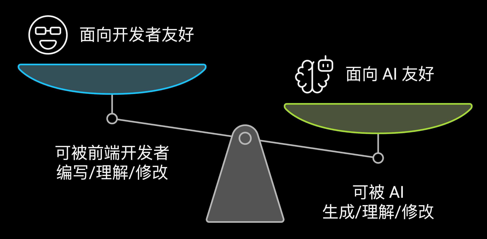
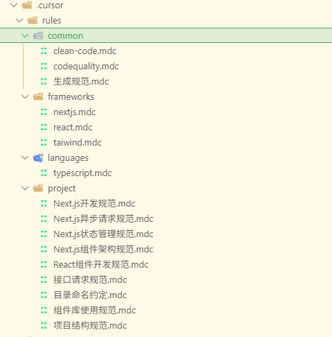

[[toc]]

# 🚀 AI 时代下前端开发的竞争力重塑：从交付代码到交付价值

> _"AI 不是要取代开发者，而是要重新定义开发者的价值"_ —— 玉伯


## 🌊 AI 时代前端开发工种面临的挑战与机遇

### 💼 **工种定义的重塑：从"代码工人"到"价值创造者"**

**传统前端开发者的困境：**

在 AI 工具普及之前，前端开发者主要面临以下问题：

- **🔄 重复性工作**：CRUD 页面、表单、样式、交互、兼容...
- **⏰ 交付效率瓶颈**：前后端联调、样式交互细节...沟通成本高
- **🔧 技术债务累积**：技术更迭快，升级成本高；不抽象 = 处处维护，高度抽象 = 无力维护...

**AI 时代的机遇与挑战：**

随着 AI 工具的普及，前端开发工种正在发生根本性转变：

#### **🎯 挑战：AI 工具带来的"能力焦虑"**

- **🤖 代码生成能力**：AI 的代码生成能力终会更好用、更易用
- **🔄 角色重新定位**：从"代码实现者"转向"需求理解者"和"价值创造者"

#### **🚀 机遇：从"交付代码"到"交付价值"**

**传统模式：代码交付**

```
需求 → 设计 → 编码 → 测试 → 部署 → 交付代码
```

**AI 时代模式：价值交付**

```md:line-numbers {1}
需求理解 → 方案设计 → AI 辅助实现、测试 → 用户体验优化 → 业务价值验证 → 持续迭代
```

**核心转变：**

<div class="grid grid-cols-1 md:grid-cols-3 gap-6 my-8">

::: warning 🔄 关注点转移
**之前**：如何写出更好的代码  
**现在**：如何创造更大的业务价值
:::

::: info 🛠️ 工具使用方式
**之前**：手写每一行代码  
**现在**：AI 生成代码，开发者优化和组合
:::

::: tip 📊 成功指标变化
**之前**：代码质量、性能指标  
**现在**：用户体验、业务指标、转化率
:::

</div>

---

## 1️⃣ AI 时代的马太效应

### 💡 马太效应：赢者通吃的时代

**在 AI 时代，技术选型比以往任何时候都重要。**

强者愈强，弱者愈弱。选择主流技术栈，意味着：

- 🎯 更好的 AI 支持
- 🌟 更丰富的生态资源
- 🛡️ 更稳定的社区支持

## 2️⃣ AI 时代技术选型的三大核心原则

<div class="grid grid-cols-1 md:grid-cols-3 gap-6 my-8">

::: tip 🤖 AI 工具支持度
**选择 AI 最懂的技术**

**为什么重要？** AI 工具对主流技术的理解度最高，能提供最准确的代码生成和建议。

- **主流框架优先**：React、Vue、Next.js - AI 理解度最高
- **远离小众技术**：AI 训练数据少，支持效果差
- **标准化模式**：React Hooks、组件 Props、事件处理等标准模式
  :::

::: info 🌱 生态成熟度
**选择最活跃的社区**

**为什么重要？** 成熟的生态意味着更多 AI 训练数据、更好的工具支持和更稳定的维护。

- **依赖包生态**：npm 包数量多，社区活跃
- **工具链支持**：Vite、Webpack、Jest 等主流工具 AI 支持好
- **类型安全**：TypeScript 生态完善，AI 理解代码结构更好
  :::

::: warning 🚀 技术先进性
**选择面向未来的技术**

**为什么重要？** 先进技术通常有更好的 AI 支持，能提升开发效率和代码质量。

- **现代构建工具**：Vite、Turbopack 等 ESM 和 HMR 机制
- **性能优化友好**：虚拟滚动、时间分片、懒加载等优化模式
- **AI 原生支持**：Next.js App Router、React Server Components 等新特性
  :::

</div>

---

## 3️⃣ AI 时代代码组织模式变革



### 🎯 传统组件封装 vs shadcn 模板式组件

#### **传统组件封装模式：过度设计的"黑盒"**

::: details 🔍 点击展开：传统 Button 组件的复杂内部实现（AI 看了想哭）

```tsx:line-numbers {1}
// 传统Button组件的内部实现 - AI完全看不懂
const Button = forwardRef<HTMLButtonElement, ButtonProps>(
  (
    {
      variant = 'default',
      size = 'default',
      loading = false,
      icon,
      iconPosition = 'left',
      rounded = 'default',
      shadow = 'default',
      hoverEffect = 'none',
      focusRing = 'default',
      animation = 'none',
      responsive = false,
      accessibility = {},
      theme = {},
      breakpoints = {},
      className,
      children,
      ...props
    },
    ref
  ) => {
    // 复杂的variant逻辑 - AI看了就晕
    const variantStyles = useMemo(() => {
      switch (variant) {
        case 'primary':
          return {
            light: { bg: theme.light?.bg || '#007bff', text: theme.light?.text || 'white' },
            dark: { bg: theme.dark?.bg || '#0056b3', text: theme.dark?.text || 'white' }
          };
        case 'secondary':
          return {
            light: { bg: theme.light?.bg || '#6c757d', text: theme.light?.text || 'white' },
            dark: { bg: theme.dark?.bg || '#545b62', text: theme.dark?.text || 'white' }
          };
        // ... 还有20+个case
      }
    }, [variant, theme]);

    // 复杂的size逻辑 - AI看了想哭
    const sizeStyles = useMemo(() => {
      const baseSizes = {
        small: { px: '8px', py: '4px', fontSize: '12px' },
        default: { px: '12px', py: '6px', fontSize: '14px' },
        large: { px: '16px', py: '8px', fontSize: '16px' }
      };

      if (responsive && breakpoints) {
        return {
          sm: baseSizes[breakpoints.sm || 'default'],
          md: baseSizes[breakpoints.md || 'default'],
          lg: baseSizes[breakpoints.lg || 'default']
        };
      }

      return baseSizes[size];
    }, [size, responsive, breakpoints]);

    // 复杂的动画逻辑 - AI看了想跳楼
    const animationStyles = useMemo(() => {
      switch (animation) {
        case 'bounce':
          return 'animate-bounce';
        case 'pulse':
          return 'animate-pulse';
        case 'spin':
          return 'animate-spin';
        // ... 还有10+个case
      }
    }, [animation]);

    // 复杂的hover效果逻辑 - AI看了想撞墙
    const hoverStyles = useMemo(() => {
      switch (hoverEffect) {
        case 'scale':
          return 'hover:scale-105 transition-transform';
        case 'lift':
          return 'hover:-translate-y-1 transition-transform';
        case 'glow':
          return 'hover:shadow-lg transition-shadow';
        // ... 还有8+个case
      }
    }, [hoverEffect]);

    // 复杂的主题逻辑 - AI看了想回家
    const currentTheme = useTheme();
    const themeStyles = useMemo(() => {
      return currentTheme === 'dark' ? variantStyles.dark : variantStyles.light;
    }, [currentTheme, variantStyles]);

    // 复杂的响应式逻辑 - AI看了想转行
    const responsiveStyles = useMemo(() => {
      if (!responsive) return {};

      return {
        '@media (max-width: 640px)': sizeStyles.sm,
        '@media (min-width: 641px) and (max-width: 1024px)': sizeStyles.md,
        '@media (min-width: 1025px)': sizeStyles.lg
      };
    }, [responsive, sizeStyles]);

    // 复杂的可访问性逻辑 - AI看了想退休
    const accessibilityProps = useMemo(() => {
      return {
        'aria-label': accessibility.ariaLabel,
        role: accessibility.role || 'button',
        tabIndex: accessibility.tabIndex || 0,
        ...(loading && { 'aria-busy': true })
      };
    }, [accessibility, loading]);

    return (
      <button
        ref={ref}
        className={cn(
          'inline-flex items-center justify-center border-0 cursor-pointer',
          'focus:outline-none focus:ring-2 focus:ring-offset-2',
          `focus:ring-${focusRing === 'default' ? 'blue' : focusRing}-500`,
          `rounded-${rounded === 'default' ? 'md' : rounded}`,
          `shadow-${shadow === 'default' ? 'sm' : shadow}`,
          animationStyles,
          hoverStyles,
          responsiveStyles,
          className
        )}
        style={{
          backgroundColor: themeStyles.bg,
          color: themeStyles.text,
          padding: `${sizeStyles.py} ${sizeStyles.px}`,
          fontSize: sizeStyles.fontSize,
          ...responsiveStyles
        }}
        disabled={loading || props.disabled}
        {...accessibilityProps}
        {...props}
      >
        {icon && iconPosition === 'left' && <span className="mr-2">{icon}</span>}
        {children}
        {icon && iconPosition === 'right' && <span className="ml-2">{icon}</span>}
        {loading && (
          <span className="ml-2">
            <Spinner size={size} />
          </span>
        )}
      </button>
    );
  }
);

Button.displayName = 'Button';
```

:::

::: details 🔍 点击展开：传统 Button 组件的复杂使用方式（50+个 props）

```tsx:line-numbers {1}
// 传统方式：过度封装，AI完全看不懂的黑盒
<Button
  variant="primary"
  size="large"
  onClick={handleClick}
  disabled={isLoading}
  loading={isLoading}
  icon={isLoading ? <Spinner /> : <CheckIcon />}
  iconPosition="left"
  rounded="full"
  shadow="lg"
  hoverEffect="scale"
  focusRing="blue"
  animation="bounce"
  responsive={true}
  accessibility={{
    ariaLabel: 'Submit form button',
    role: 'button',
    tabIndex: 0
  }}
  theme={{
    light: { bg: 'blue-500', text: 'white' },
    dark: { bg: 'blue-600', text: 'white' }
  }}
  breakpoints={{
    sm: { size: 'small' },
    md: { size: 'medium' },
    lg: { size: 'large' }
  }}
>
  {isLoading ? 'Loading...' : 'Submit'}
</Button>
```

:::

**特点：**

- **🚫 过度抽象**：一个按钮组件包含 50+个 props，内部逻辑复杂到爆炸
- **🔄 可维护性"高"**：逻辑集中，但每次修改都要考虑 50+个 props 的兼容性
- **🤖 AI 完全懵逼**：内部实现是黑盒，AI 看到这堆 props 就晕了
- **🎨 定制化困难**：想改个颜色都要通过 theme 系统，想改个样式要翻遍文档
- **🐛 Bug 温床**：50+个 props 的组合爆炸，测试覆盖不过来
- **📚 学习成本高**：同事要 3 天才能搞懂这个 Button 怎么用，不敢轻易修改，干脆复制一份

---

#### **shadcn + Tailwind CSS 模式：AI 时代的"透明模板"**

::: details 🔍 点击展开：shadcn Button 组件的简洁内部实现（AI 看了想点赞）

```tsx:line-numbers {1}
// shadcn Button组件的内部实现 - AI看了想点赞
const Button = React.forwardRef<
  HTMLButtonElement,
  React.ButtonHTMLAttributes<HTMLButtonElement> & VariantProps<typeof buttonVariants>
>(({ className, variant, size, asChild = false, ...props }, ref) => {
  const Comp = asChild ? Slot : 'button';

  return <Comp className={cn(buttonVariants({ variant, size, className }))} ref={ref} {...props} />;
});

// 样式变体定义 - 简单到AI都能背下来
const buttonVariants = cva(
  'inline-flex items-center justify-center whitespace-nowrap rounded-md text-sm font-medium ring-offset-background transition-colors focus-visible:outline-none focus-visible:ring-2 focus-visible:ring-ring focus-visible:ring-offset-2 disabled:pointer-events-none disabled:opacity-50',
  {
    variants: {
      variant: {
        default: 'bg-primary text-primary-foreground hover:bg-primary/90',
        destructive: 'bg-destructive text-destructive-foreground hover:bg-destructive/90',
        outline: 'border border-input bg-background hover:bg-accent hover:text-accent-foreground',
        secondary: 'bg-secondary text-secondary-foreground hover:bg-secondary/80',
        ghost: 'hover:bg-accent hover:text-accent-foreground',
        link: 'text-primary underline-offset-4 hover:underline'
      },
      size: {
        default: 'h-10 px-4 py-2',
        sm: 'h-9 rounded-md px-3',
        lg: 'h-11 rounded-md px-8',
        icon: 'h-10 w-10'
      }
    },
    defaultVariants: {
      variant: 'default',
      size: 'default'
    }
  }
);
```

:::

::: details 🔍 点击展开：shadcn Button 组件的简洁使用方式

```tsx:line-numbers {1}
// shadcn方式：简单透明，AI一眼就能看懂
<Button
  className="bg-blue-500 hover:bg-blue-600 text-white px-4 py-2 rounded-md
             shadow-lg hover:shadow-xl transition-all duration-200
             disabled:opacity-50 disabled:cursor-not-allowed"
  onClick={handleClick}
  disabled={isLoading}
>
  {isLoading ? (
    <div className="flex items-center gap-2">
      <div className="w-4 h-4 border-2 border-white border-t-transparent rounded-full animate-spin" />
      Loading...
    </div>
  ) : (
    'Submit'
  )}
</Button>
```

:::

**特点：**

- **✨ 透明设计**：组件逻辑简单到 AI 一眼就能看懂
- **🎨 高度可定制**：想改什么样式，直接改 className 就行
- **🤖 AI 超友好**：Tailwind 类名语义化，AI 理解度爆表
- **🔄 可抛弃性**：组件简单，AI 可以轻松重构，重写成本为 0
- **📖 学习成本低**：新同事 5 分钟就能上手
- **🚀 开发效率高**：AI 能快速生成和修改，开发速度翻倍

---

### 📏 **上下文长度优化：TailWind 的附赠**

#### **为什么 Tailwind CSS 能更好地控制上下文长度？**

**传统 CSS 方式 - 上下文长度爆炸：**

::: details 🔍 点击展开：传统 CSS 的上下文长度爆炸示例

```css:line-numbers {1}
/* 传统CSS：一个按钮需要大量上下文 */
.button-primary {
  background: linear-gradient(135deg, #667eea 0%, #764ba2 100%);
  color: #ffffff;
  padding: 12px 24px;
  font-size: 16px;
  font-weight: 600;
  border: 2px solid #667eea;
  border-radius: 8px;
  box-shadow: 0 4px 15px 0 rgba(116, 75, 162, 0.4);
  transition: all 0.3s ease;
}

.button-primary:hover {
  background: linear-gradient(135deg, #5a6fd8 0%, #6a4190 100%);
  transform: translateY(-2px);
  box-shadow: 0 6px 20px 0 rgba(116, 75, 162, 0.6);
}

/* 响应式设计 */
@media (max-width: 768px) {
  .button-primary {
    font-size: 14px;
    padding: 10px 20px;
  }
}
```

:::

**Tailwind CSS 方式 - 上下文长度优化：**

::: details 🔍 点击展开：Tailwind CSS 的上下文长度优化示例

```tsx:line-numbers {1}
// Tailwind CSS：所有样式都在一个地方，上下文集中
<button
  className="
  bg-gradient-to-br from-indigo-500 to-purple-600 text-white
  px-6 py-3 text-base font-semibold
  border-2 border-indigo-500 rounded-lg
  shadow-lg hover:shadow-xl transition-all duration-300
  hover:from-indigo-600 hover:to-purple-700 hover:-translate-y-0.5
  sm:text-sm sm:px-4 sm:py-2
  md:text-base md:px-6 md:py-3
  lg:text-lg lg:px-8 lg:py-4
"
>
  Click me!
</button>
```

:::

#### **AI 时代上下文长度的重要性**

**为什么 AI 更喜欢短的上下文？**

1. **注意力机制**：AI 的注意力机制在处理长上下文时会分散
2. **理解效率**：短上下文让 AI 能更快理解代码意图
3. **生成准确性**：上下文越短，AI 生成的代码越准确

**实际例子：AI 生成代码的对比**

**传统 CSS 方式 - AI 需要长上下文：**

::: details 🔍 点击展开：传统 CSS 方式的 AI 生成示例

```tsx:line-numbers {1}
// AI需要理解：CSS文件 + JSX文件 + 类名映射关系
<Button className="button-primary" />
```

:::

**Tailwind CSS 方式 - AI 只需要短上下文：**

::: details 🔍 点击展开：Tailwind CSS 方式的 AI 生成示例

```tsx:line-numbers {1}
// AI只需要理解：JSX中的className
<Button className="bg-blue-500 hover:bg-blue-600 sm:text-sm md:text-base" />
```

:::

### 🎨 Tailwind CSS：恰好顺应 AI 时代的设计潮流

#### **为什么 Tailwind CSS 是 AI 友好的？**

1. **语义化类名**：AI 理解`bg-blue-500`比理解 CSS 变量更容易
2. **原子化设计**：每个类名都有明确含义，AI 能准确组合
3. **一致性**：设计系统统一，AI 生成的样式更协调
4. **可预测性**：类名行为一致，AI 能准确预测效果

#### **传统 CSS：语法标准化，但语义模糊**

::: details 🔍 点击展开：传统 CSS 的复杂样式（AI 理解困难）

```css:line-numbers {1}
/* 传统CSS：语法是标准的，但每个值对AI来说都是"魔法数字" */
.button-primary {
  /* 背景渐变 - AI需要理解复杂的CSS函数和角度值 */
  background: linear-gradient(135deg, #667eea 0%, #764ba2 100%);

  /* 阴影 - AI需要理解4个数值的含义和组合效果 */
  box-shadow: 0 4px 15px 0 rgba(116, 75, 162, 0.4);

  /* 过渡 - AI需要理解"all"的含义和缓动函数 */
  transition: all 0.3s ease;

  /* 尺寸 - AI不知道这些数值代表什么效果 */
  padding: 12px 24px;
  font-size: 16px;
  line-height: 1.5;

  /* 颜色 - AI需要理解十六进制和RGBA的差异 */
  color: #ffffff;
  border: 2px solid #667eea;

  /* 圆角 - AI不知道8px的圆角效果如何 */
  border-radius: 8px;
}

/* 状态变化 - AI需要理解伪类选择器和对应的样式值 */
.button-primary:hover {
  /* AI不知道-2px的位移效果如何 */
  transform: translateY(-2px);
  /* AI不知道这些阴影值的变化逻辑 */
  box-shadow: 0 6px 20px 0 rgba(116, 75, 162, 0.6);
}

/* 响应式 - AI需要理解像素断点的含义 */
@media (max-width: 768px) {
  .button-primary {
    /* AI不知道为什么要改成这些值 */
    font-size: 14px;
    padding: 10px 20px;
  }
}
```

:::

**AI 理解传统 CSS 的核心困难：**

1. **🎯 语义缺失**：

   - `16px` = 大字体还是小字体？AI 不知道
   - `8px` = 圆角效果如何？AI 不知道
   - `135deg` = 渐变角度效果如何？AI 不知道

2. **🔢 数值无意义**：

   - `12px 24px` = 这个间距合适吗？AI 不知道
   - `0.3s` = 过渡时长合适吗？AI 不知道
   - `0.4` = 透明度效果如何？AI 不知道

3. **🎨 组合效果不可预测**：
   - 多个 CSS 属性组合的最终效果，AI 难以预测
   - 需要理解 CSS 的层叠和继承规则

---

#### **Tailwind CSS：语法和语义都标准化**

::: details 🔍 点击展开：Tailwind CSS 的语义化样式（AI 理解容易）

```tsx:line-numbers {1}
// Tailwind CSS：每个类名都有明确的语义
<button
  className="
  /* 背景和颜色 - 语义清晰 */
  bg-gradient-to-br from-indigo-500 to-purple-600
  text-white

  /* 尺寸和间距 - 数字有含义 */
  px-6 py-3          /* 6=24px, 3=12px - AI理解数字规律 */
  text-base           /* 基础字体大小 - AI知道这是标准大小 */
  font-semibold       /* 半粗体 - AI理解字重含义 */
  leading-relaxed     /* 宽松行高 - AI理解行高效果 */

  /* 边框和圆角 - 语义化命名 */
  border-2            /* 2px边框 - AI理解边框粗细 */
  border-indigo-500   /* 靛蓝色边框 - AI理解颜色系统 */
  rounded-lg          /* 大圆角 - AI知道这是适中的圆角 */

  /* 阴影和过渡 - 效果可预测 */
  shadow-lg           /* 大阴影 - AI知道阴影效果 */
  hover:shadow-xl     /* 悬停时超大阴影 - AI理解状态变化 */
  transition-all      /* 所有属性过渡 - AI理解过渡范围 */
  duration-300        /* 300ms过渡 - AI理解时长 */

  /* 交互状态 - 状态变化语义化 */
  hover:from-indigo-600 hover:to-purple-700  /* 悬停时颜色变深 */
  hover:-translate-y-0.5                     /* 悬停时向上移动 */
  active:translate-y-0                        /* 点击时回到原位 */
  active:shadow-md                            /* 点击时中等阴影 */

  /* 禁用状态 - 语义化禁用样式 */
  disabled:opacity-60         /* 禁用时60%透明度 */
  disabled:cursor-not-allowed /* 禁用时禁止光标 */
  disabled:bg-gray-400        /* 禁用时灰色背景 */
  disabled:text-gray-600      /* 禁用时深灰文字 */

  /* 响应式设计 - 断点语义化 */
  sm:text-sm sm:px-4 sm:py-2   /* 小屏幕：小字体，小间距 */
  md:text-base md:px-6 md:py-3 /* 中屏幕：标准字体，标准间距 */
  lg:text-lg lg:px-8 lg:py-4   /* 大屏幕：大字体，大间距 */
"
>
  Click me!
</button>
```

:::

**AI 理解 Tailwind CSS 的核心优势：**

1. **🎯 语义化类名**：

   - `bg-blue-500` = "蓝色背景，500 是中等深浅" - AI 秒懂
   - `px-6` = "水平内边距 6 个单位（24px）" - AI 理解数字含义
   - `rounded-lg` = "大圆角" - AI 知道这是适中的圆角效果

2. **🔢 数字系统有规律**：

   - `text-sm`、`text-base`、`text-lg` - AI 理解大小关系
   - `px-2`、`px-4`、`px-6`、`px-8` - AI 理解间距规律（8px、16px、24px、32px）
   - `opacity-50`、`opacity-75`、`opacity-100` - AI 理解透明度（50%、75%、100%）

3. **🎨 颜色系统可预测**：

   - `from-indigo-500`、`to-purple-600` - AI 理解渐变方向和颜色深浅
   - `hover:from-indigo-600` - AI 理解悬停时颜色变深的逻辑
   - `disabled:bg-gray-400` - AI 理解禁用状态使用灰色

4. **📱 响应式断点清晰**：
   - `sm:`、`md:`、`lg:` - AI 理解断点的语义（小、中、大屏幕）
   - 每个断点都有明确的含义，AI 容易生成响应式代码

---

---

#### **实际代码生成对比**

**传统 CSS - AI 生成困难：**

::: details 🔍 点击展开：传统 CSS 的 AI 生成困难示例

```css:line-numbers {1}
/* AI需要理解复杂的CSS语法，容易出错 */
.button-custom {
  /* AI可能不知道这些值是否合适 */
  background: linear-gradient(135deg, #667eea 0%, #764ba2 100%);
  box-shadow: 0 4px 15px 0 rgba(116, 75, 162, 0.4);

  /* AI可能忘记添加transition */
  /* AI可能不理解hover状态应该如何变化 */
  /* AI可能不知道响应式断点应该设置什么值 */
}
```

:::

**Tailwind CSS - AI 生成容易：**

::: details 🔍 点击展开：Tailwind CSS 的 AI 生成容易示例

```tsx:line-numbers {1}
// AI只需要组合语义化的类名，不容易出错
className="bg-gradient-to-br from-blue-500 to-purple-600
           shadow-lg hover:shadow-xl hover:from-blue-600 hover:to-purple-700
           transition-all duration-300
           sm:text-sm sm:px-4 md:text-base md:px-6 lg:text-lg lg:px-8"
// 每个类名都有明确含义，AI容易理解和组合
```

:::

#### **核心洞察**

**传统 CSS 的问题不在于语法，而在于语义：**

1. **CSS 语法确实是标准化的** - 所有浏览器都理解相同的语法
2. **但 CSS 值没有语义** - `16px`、`#667eea`、`135deg`对 AI 来说都是无意义的数字
3. **属性组合效果不可预测** - 多个 CSS 属性组合的最终效果，AI 难以预测

**Tailwind CSS 解决了语义问题：**

1. **每个类名都有明确语义** - `bg-blue-500` = "蓝色背景，中等深浅"
2. **数字系统有规律** - `px-6` = "24px"，`text-lg` = "大字体"
3. **效果可预测** - 每个类名的效果都是预定义的，AI 容易理解

**结论：Tailwind CSS 让 AI 从"理解 CSS 语法"变成了"理解样式语义"，大大降低了 AI 的认知负担！**

---

---

### 🔄 代码组织模式的未来趋势

#### **1. 从"可维护"到"可重构"**

- **传统思维**：写一次，维护一辈子
- **AI 时代思维**：写简单，AI 重构

#### **2. 从"黑盒组件"到"透明模板"**

- **传统组件**：高度封装，难以定制
- **shadcn 模式**：模板化设计，高度可定制

#### **3. 从"复杂逻辑"到"简单组合"**

- **传统方式**：一个组件包含复杂逻辑
- **AI 时代方式**：简单组件通过组合实现复杂功能

#### **4. 从"长期维护"到"快速迭代"**

- **传统思维**：代码要能长期维护
- **AI 时代思维**：代码要能快速重构和替换

### 💡 **可维护代码 vs 可抛弃代码：AI 时代的代码哲学**

#### **传统代码哲学："可维护性"**

<div class="grid grid-cols-1 md:grid-cols-2 gap-6 my-8">

::: info 🔧 **可维护代码的特点**

- **高度抽象**：复杂的抽象层，隐藏实现细节
- **文档完善**：详细的注释和文档说明
- **向后兼容**：新版本必须兼容旧版本
- **防御性编程**：大量的边界检查和错误处理
- **设计模式**：严格遵循设计模式原则
  :::

::: warning ⚠️ **可维护代码的问题**

1. **过度工程化**：为了"可维护性"而过度设计
2. **开发速度慢**：写一个简单功能需要大量样板代码
3. **AI 理解困难**：复杂的抽象层让 AI 难以理解代码意图
4. **重构成本高**：修改一个功能需要理解整个抽象体系
5. **学习成本高**：新同事需要学习复杂的架构设计
   :::

</div>

#### **AI 时代代码哲学："可抛弃性"**

<div class="grid grid-cols-1 md:grid-cols-2 gap-6 my-8">

::: tip ✨ **可抛弃代码的特点**

- **简单直接**：代码逻辑清晰，没有过度抽象
- **功能聚焦**：每个函数/组件只做一件事
- **易于重构**：AI 可以快速理解和重构
- **自解释**：代码本身就是最好的文档
- **快速迭代**：可以快速重写，不担心破坏现有架构
  :::

::: info 🚀 **可抛弃代码的优势**

1. **开发速度快**：写代码快，改代码更快
2. **AI 友好**：AI 容易理解和生成
3. **重构成本低**：重写比修改更容易
4. **学习成本低**：新同事 5 分钟就能上手
5. **创意自由**：不被复杂架构束缚
   :::

</div>

#### **AI 时代的选择：什么时候用哪种？**

<div class="grid grid-cols-1 md:grid-cols-2 gap-6 my-8">

::: tip 🚀 **选择可抛弃代码的场景**

1. **快速原型**：需要快速验证想法
2. **频繁迭代**：功能还在探索阶段
3. **AI 辅助开发**：希望 AI 能快速理解和重构
4. **简单功能**：CRUD、表单、列表等基础功能
5. **MVP 阶段**：产品还在验证阶段
   :::

::: warning 🏗️ **选择可维护代码的场景**

1. **核心架构**：系统的基础设施和核心服务
2. **关键业务**：不能出错的业务逻辑
3. **长期稳定**：功能已经稳定，长期不会改变
4. **团队协作**：多人维护的公共组件
5. **安全敏感**：涉及安全、权限等敏感功能
   :::

</div>

#### **实践建议：如何写可抛弃代码？**

**1. 保持简单**

::: details 🔍 点击展开：保持简单的代码示例

```tsx:line-numbers {1}
// ❌ 过度设计
const Button = forwardRef<HTMLButtonElement, ButtonProps>((props, ref) => {
  const {
    variant,
    size,
    loading,
    icon,
    iconPosition,
    rounded,
    shadow,
    hoverEffect,
    focusRing,
    animation,
    responsive,
    accessibility,
    theme,
    breakpoints,
    className,
    children,
    ...restProps
  } = props;

  // 复杂的逻辑处理...
});

// ✅ 简单直接
const Button = ({ className, children, ...props }) => (
  <button className={cn('px-4 py-2 rounded bg-blue-500 text-white', className)} {...props}>
    {children}
  </button>
);
```

:::

**2. 功能聚焦**

::: details 🔍 点击展开：功能聚焦的代码示例

```tsx:line-numbers {1}
// ❌ 一个组件做太多事
const UserCard = ({
  user,
  onEdit,
  onDelete,
  onShare,
  onFollow,
  showActions,
  showStats,
  showAvatar
}) => {
  // 复杂的条件渲染和状态管理...
};

// ✅ 功能聚焦
const UserCard = ({ user }) => (
  <div className="p-4 border rounded">
    <h3>{user.name}</h3>
    <p>{user.email}</p>
  </div>
);

const UserActions = ({ user, onEdit, onDelete }) => (
  <div className="flex gap-2">
    <button onClick={() => onEdit(user)}>Edit</button>
    <button onClick={() => onDelete(user.id)}>Delete</button>
  </div>
);
```

:::

**3. 避免过度抽象**

::: details 🔍 点击展开：避免过度抽象的代码示例

```tsx:line-numbers {1}
// ❌ 过度抽象
const useUserData = (userId: string) => {
  const [user, setUser] = useState<User | null>(null);
  const [loading, setLoading] = useState(false);
  const [error, setError] = useState<Error | null>(null);

  useEffect(() => {
    // 复杂的逻辑...
  }, [userId]);

  return { user, loading, error };
};

// ✅ 简单直接
const getUser = async (id: string) => {
  const response = await fetch(`/api/users/${id}`);
  return response.json();
};
```

:::

**4. 让代码自解释**

::: details 🔍 点击展开：让代码自解释的示例

```tsx:line-numbers {1}
// ❌ 需要注释才能理解
const processData = data => {
  const result = [];
  for (let i = 0; i < data.length; i++) {
    if (data[i].status === 'active' && data[i].score > 80) {
      result.push({
        id: data[i].id,
        name: data[i].name,
        priority: 'high'
      });
    }
  }
  return result;
};

// ✅ 自解释的代码
const getHighPriorityActiveUsers = users => {
  return users
    .filter(user => user.status === 'active' && user.score > 80)
    .map(user => ({
      id: user.id,
      name: user.name,
      priority: 'high'
    }));
};
```

:::

#### **AI 时代的代码组织原则**

<div class="grid grid-cols-1 md:grid-cols-2 lg:grid-cols-3 gap-6 my-8">

::: tip 1️⃣ 简单优于复杂

- 能用简单方式实现，就不要用复杂方式
- 代码越简单，AI 越容易理解和重构
  :::

::: info 2️⃣ 可读性优于可维护性

- 代码要让人一眼就能看懂
- 不要为了"可维护性"而牺牲可读性
  :::

::: warning 3️⃣ 组合优于继承

- 用简单的组件组合实现复杂功能
- 避免复杂的继承和抽象层次
  :::

::: danger 4️⃣ 快速迭代优于完美设计

- 先实现功能，再优化代码
- 不要过度设计，代码可以随时重写
  :::

::: tip 5️⃣ AI 友好优于人工优化

- 代码要能让 AI 快速理解
- 简单的逻辑比复杂的优化更重要
  :::

</div>

#### **总结：AI 时代的代码哲学**

- **可维护代码**：为了长期维护而设计，但开发慢、AI 理解困难
- **可抛弃代码**：为了快速迭代而设计，开发快、AI 理解容易

---

## 4️⃣ 上下文工程（Context Engineering）：让 AI 成为你的专属助手


### **🔍 AI 还是不够懂我**

**问题分析**：很多开发者抱怨 AI 生成的代码不符合需求，其实问题不在 AI，而在于：

- ❌ **缺乏项目上下文（Project Context）**：AI 不知道你的项目结构、架构设计、依赖关系
- ❌ **不了解开发习惯（Development Patterns）**：AI 不知道你喜欢怎么写代码、用什么技术栈
- ❌ **没有工作流程（Workflow Context）**：AI 不知道你的开发节奏、代码审查标准
- ❌ **缺少工具集成（Tool Integration）**：AI 不知道如何使用外部工具、API 和服务

**根本原因**：AI 缺乏足够的上下文信息来理解你的具体需求和约束条件

**解决方案**：通过系统性的上下文工程（Context Engineering），让 AI 从"通用助手"变成"你的专属助手"

::: details 🔍 点击展开：什么是上下文工程（Context Engineering）？

### **🧠 什么是上下文工程（Context Engineering）？**

**核心洞察**：随着大语言模型（LLM）的广泛应用，开发者发现了一个关键事实：**模型性能的优劣，不仅取决于模型本身的规模和参数量，更取决于它在推理时"看见了什么"**。

**定义**：上下文工程（Context Engineering）是一门围绕大模型输入上下文的设计、管理和动态构建技术体系，目的是让模型在每一次调用中都能获取最合适、最相关的背景信息、任务指令和外部工具接口。

**核心价值**：提升 AI 响应的准确性、稳定性和可控性。

### **🔑 提示工程 vs 上下文工程**

| 提示工程（Prompt Engineering） | 上下文工程（Context Engineering） |
| ------------------------------ | --------------------------------- |
| 关注"怎么问"                   | 关注"模型看到了什么"              |
| 优化用户指令                   | 优化模型输入上下文                |
| 提升提问技巧                   | 提升上下文质量                    |

**关键洞察**：在实际应用中，"看到什么"对模型表现的影响，往往比"怎么问"更为关键。

:::

### **📥 上下文进入 LLM 的三种方式**

1. **提示（Prompt）**：用户指令、任务描述
2. **检索（Retrieval）**：外部文档、知识库
3. **工具调用（Tool Calls）**：API 接口、外部服务

**这就是为什么我们需要上下文工程：让 AI"看见"最相关的信息，而不是仅仅优化提问方式！**

### **🎯 我们可以做些什么？4 个工具让你事半功倍**

#### **1. 📚 知识库：AI 的"项目说明书"**

**作用**：就像给 AI 一本项目手册，让它了解你的项目

**实际效果**：

- AI 知道你的项目结构
- AI 理解你的代码风格
- AI 能给出更准确的建议

**简单例子**：

```
AI：这个按钮应该怎么写？
你：参考我们项目中的Button组件
AI：好的，我看到了，按照你们的风格来写
```

**🎯 具体实现：项目文档 + 代码规范**

**建立项目知识库的方法**：

1. **项目 README**：项目介绍、架构说明、开发指南
2. **代码规范文档**：命名规范、组件设计原则、最佳实践
3. **组件库文档**：每个组件的使用说明、Props 定义、示例代码
4. **架构图**：项目结构、数据流、组件关系

**📊 高级方案：RepoMix + 分层策略**

**RepoMix 的优势**：能提供完整的项目上下文
**RepoMix 的挑战**：可能产生过长的上下文

[RepoMix](https://repomix.com/zh-cn/)

**分层使用策略**：

```
第一层：项目文档（README、架构图）
第二层：关键模块文档（核心组件、重要逻辑）
第三层：RepoMix打包（特定模块，而非整个项目）
```

**实际应用**：

- **日常开发**：使用项目文档和代码规范
- **架构分析**：使用 RepoMix 打包关键模块
- **深度重构**：按需使用 RepoMix，避免上下文爆炸

#### **2. 🔄 工作流：AI 的"操作指南"**

**作用**：告诉 AI 你的工作习惯和流程

**实际效果**：

- AI 知道你先写什么，后写什么
- AI 能按照你的习惯生成代码
- AI 不会做无用功

**简单例子**：

```
你：我要写一个登录页面
AI：好的，按照你的习惯：
1. 先写页面结构
2. 再写样式
3. 最后写逻辑
```

#### **3. ⚙️ Cursor Rules：AI 的"个人偏好设置"**



[awesome-cursorrules](https://github.com/PatrickJS/awesome-cursorrules)

**作用**：就像设置手机主题一样，让 AI 按照你的喜好工作

**实际效果**：

- AI 生成的代码符合你的风格
- AI 知道你喜欢用什么技术
- AI 不会推荐你不熟悉的东西

**简单例子**：

::: details 🔍 点击展开：Cursor Rules

```md:line-numbers {1}
---
alwaysApply: true
---

# 接口请求规范

## 定义规范

- 使用 `axios` 进行接口请求
- 使用 `@tanstack/react-query` 进行接口请求，具体声明范式参考`/src/lib/api`，具体声明范式参考`/src/lib/api`，/src/lib/api 下区分了不同模块的接口，core 为核心封装模块，其余为业务接口封装，每个模块接口下方都可以有 api.ts（声明接口）、index.ts（useQuery、useMutation 包装接口），type.ts（声明接口参数和返回值类型），接口默认不缓存，获取最新数据
- 优化接口请求性能

## 接口文档

- 接口文档为 swagger 格式，存放在`/src/docs/`目录下
- 生成接口要求有完备的类型声明，简单类型直接写在`src/lib/api/**/api.ts`文件里，复杂类型写在`src/lib/api/**/type.ts`文件里导出供业务侧使用，禁止在`src/lib/api/**/api.ts`文件里写复杂类型
- 对于枚举值，需要在 type.ts 中使用枚举的方式来声明使用，禁止使用硬编码来做判断
- 严格遵照对应的接口文档声明参数
```

:::

```
你：对接/api/getUsers接口
AI：好的，我会先查看/docs下的接口文档，生成基础请求函数及其类型，再使用react-query包装，最后集成到业务中
```

#### **4. 🔌 MCP 工具：AI 的"能力扩展接口"**

**作用**：通过标准协议，让 AI 能够访问各种外部能力和服务

**MCP vs 知识库的区别**：

- **知识库**：静态信息，存储在本地或项目中（如项目文档、代码规范）
- **MCP 服务**：协议接口，提供各种能力（如查询、操作、集成等）

**实际效果**：

- AI 能查询外部知识库（如 Context7、文档库）
- AI 能直接操作你的文件
- AI 能运行命令
- AI 能搜索网络信息
- AI 能连接各种服务

**🎯 具体实现：常用 MCP 服务示例**

**RepoMix MCP**：代码库分析

```
AI：帮我分析这个项目的Button组件使用情况
RepoMix MCP：好的，我扫描代码库，找到所有Button的使用位置和样式
```

**Context7 MCP**：文档查询

```
AI：帮我查询React 18的最新特性
Context7 MCP：好的，我搜索React官方文档，找到最新特性说明
```

**文件操作 MCP**：直接操作

```
AI：帮我创建一个新的Button组件
文件操作MCP：好的，我直接在src/components/Button.tsx创建文件
```

**网络搜索 MCP**：实时信息

```
AI：帮我搜索最新的Tailwind CSS最佳实践
网络搜索MCP：好的，我搜索网络，找到最新的最佳实践文章
```

### **它们之间的关系：就像搭积木**

- **知识库**：告诉 AI"是什么"
- **工作流**：告诉 AI"怎么做"
- **Rules**：告诉 AI"你喜欢什么"
- **MCP 工具**：给 AI"超能力"

### **🎯 总结：我们可以做些什么？**

**核心行动指南**：不是让 AI 更聪明，而是让 AI 更懂你

**具体行动**：

1. **建立知识库**：整理项目文档、代码规范，让 AI 了解你的项目
2. **定义工作流**：告诉 AI 你的开发习惯和流程
3. **设置 Rules**：配置 AI 的偏好，让它按你的风格工作
4. **集成 MCP 工具**：给 AI 扩展能力，让它能查询、操作、集成各种服务

**预期效果**：

- 🚀 **开发效率提升**：AI 生成的代码更符合需求
- 🎯 **沟通成本降低**：不需要反复解释需求
- 💡 **创意激发**：AI 能给出更精准的建议
- 🔄 **迭代加速**：快速重构和优化代码

**记住**：最好的 AI 不是最聪明的，而是最懂你的！

---

## 🎯 从交付代码到交付价值：AI 时代前端开发的核心转变

### 💡 **为什么前端开发者必须从"代码工人"转向"价值创造者"？**

**传统前端开发的局限性：**

在 AI 工具普及之前，前端开发者往往被定位为"代码工人"，主要职责是：

- **📝 代码实现**：将设计稿转换为可运行的代码
- **🔧 功能开发**：实现产品经理提出的功能需求
- **🐛 Bug 修复**：解决测试过程中发现的问题
- **📱 兼容性处理**：确保在不同设备和浏览器上的兼容性

**这种定位的问题：**

1. **🚫 价值创造能力有限**：只关注代码质量，不关注业务价值
2. **📊 难以量化贡献**：无法证明自己的工作对业务的实际影响
3. **🔄 容易被替代**：AI 工具可以快速生成基础代码
4. **💼 职业发展瓶颈**：缺乏业务理解能力，难以晋升到更高层级

### 🚀 **AI 时代前端开发者的新定位：价值创造者**

#### **核心能力转变**

**从"代码实现者"到"解决方案设计师"：**

- **🎯 需求理解**：深入理解业务需求和用户痛点，而不仅仅是功能需求
- **💡 方案设计**：设计最优的技术解决方案，考虑性能、可维护性、扩展性
- **🔄 持续优化**：基于数据和用户反馈，持续优化产品体验

**从"功能开发者"到"用户体验专家"：**

- **🎨 交互设计**：优化用户交互流程，提升操作效率
- **📱 响应式设计**：确保在各种设备上的最佳体验
- **⚡ 性能优化**：提升页面加载速度和交互响应性
- **♿ 可访问性**：确保产品对所有用户都友好

**从"代码维护者"到"系统监控专家"：**

- **📊 前端监控**：建立完善的错误监控、性能监控、用户行为监控
- **🔍 问题诊断**：快速定位和解决线上问题
- **📈 数据分析**：分析用户行为数据，为产品优化提供依据

#### **具体业务价值能力**

<div class="grid grid-cols-1 md:grid-cols-2 gap-6 my-8">

::: tip 🎯 用户体验优化能力
**页面性能优化：**

- 首屏加载时间优化（目标：< 2 秒）
- 交互响应时间优化（目标：< 100ms）
- 资源加载优化（图片懒加载、代码分割、缓存策略）

**交互体验优化：**

- 表单验证和错误提示优化
- 加载状态和空状态设计
- 微交互和动画效果
- 移动端手势操作优化
  :::

::: info 📊 前端监控体系建设
**错误监控：**

- JavaScript 运行时错误捕获
- 资源加载失败监控
- API 请求异常监控
- 用户操作异常监控

**性能监控：**

- 页面加载性能指标（FCP、LCP、CLS）
- 交互性能指标（FID、TTI）
- 资源加载性能分析
- 用户真实性能数据收集

**用户行为监控：**

- 页面访问路径分析
- 功能使用率统计
- 用户操作热力图
- 转化漏斗分析
  :::

::: warning 🧪 前端测试体系
**单元测试：**

- 组件功能测试
- 工具函数测试
- 状态管理测试
- 覆盖率要求（> 80%）

**集成测试：**

- 组件间交互测试
- 页面流程测试
- API 集成测试
- 端到端测试

**性能测试：**

- 页面加载性能测试
- 内存泄漏检测
- 长列表渲染性能测试
- 并发用户压力测试
  :::

::: danger 🔧 工程化能力
**构建优化：**

- 代码分割和懒加载
- Tree Shaking 和 Dead Code Elimination
- 资源压缩和优化
- 构建时间优化

**部署优化：**

- 自动化部署流程
- 灰度发布策略
- 回滚机制
- 环境配置管理
  :::

</div>

### 💰 **价值交付的量化指标和 ROI 分析**

#### **从代码指标到业务指标**

<div class="grid grid-cols-1 md:grid-cols-2 gap-6 my-8">

::: danger ❌ 传统代码指标（输入导向）

- 代码行数、复杂度、覆盖率
- 性能分数、加载时间
- 错误率、兼容性
  :::

::: tip ✅ AI 时代业务指标（输出导向）

- **用户体验指标**：页面加载速度、交互响应时间、用户满意度
- **业务转化指标**：点击率、转化率、用户留存率、订单完成率
- **开发效率指标**：功能交付速度、迭代周期、维护成本、Bug 修复时间
  :::

</div>

#### **实际 ROI 案例分析**

**案例 1：电商产品页面性能优化**

```
优化前：
- 首屏加载时间：4.2秒
- 转化率：2.1%
- 用户跳出率：68%

优化后：
- 首屏加载时间：1.8秒（提升 57%）
- 转化率：3.2%（提升 52%）
- 用户跳出率：45%（降低 34%）

业务价值：
- 日活用户 10万，转化率提升 1.1%
- 日均订单增加 110单
- 客单价 200元，日收入增加 22,000元
- 月收入增加 66万元
```

**案例 2：管理后台用户体验优化**

```
优化前：
- 用户操作完成率：65%
- 平均操作时间：3.2分钟
- 客服咨询量：日均 50次

优化后：
- 用户操作完成率：89%（提升 37%）
- 平均操作时间：1.8分钟（减少 44%）
- 客服咨询量：日均 18次（减少 64%）

业务价值：
- 减少客服人力成本：32次/天 × 50元/次 × 22天 = 35,200元/月
- 提升员工工作效率：节省时间 1.4分钟/次 × 1000次/天 × 22天 = 308小时/月
- 按员工时薪 100元计算，月节省成本：30,800元
- 总月节省成本：66,000元
```

**案例 3：前端监控体系建立**

```
建立前：
- 线上问题发现时间：平均 2小时
- 问题解决时间：平均 4小时
- 用户投诉率：3.2%

建立后：
- 线上问题发现时间：平均 5分钟（提升 96%）
- 问题解决时间：平均 1.5小时（提升 63%）
- 用户投诉率：1.1%（降低 66%）

业务价值：
- 减少问题影响时间：1.75小时/次 × 10次/月 = 17.5小时/月
- 按影响用户 1000人/次，用户时薪 50元计算
- 月节省成本：17.5小时 × 1000人 × 50元 = 875,000元
```

### 🎯 **如何建立价值交付能力体系**

#### **1. 建立数据驱动的开发文化**

**关键指标监控：**

- 建立核心业务指标看板
- 设置性能指标告警阈值
- 定期分析用户行为数据
- 建立 A/B 测试机制

**数据收集和分析：**

- 前端埋点体系建设
- 用户行为数据收集
- 性能数据实时监控
- 错误日志智能分析

#### **2. 建立用户体验优化流程**

**用户研究：**

- 用户访谈和调研
- 用户行为数据分析
- 竞品分析和对比
- 用户反馈收集和分析

**优化迭代：**

- 基于数据的优化决策
- 快速原型和验证
- 持续迭代和优化
- 效果评估和总结

#### **3. 建立前端质量保障体系**

**代码质量：**

- 代码规范检查
- 自动化测试
- 代码审查流程
- 性能基准测试

**发布质量：**

- 自动化部署流程
- 灰度发布策略
- 监控告警机制
- 快速回滚能力

---

## 🎯 **总结**

### 💡 **核心转变**

AI 时代，前端开发者从"代码工人"转向"价值创造者"：

- **交付内容**：从代码到价值
- **技术选型**：选择 AI 友好的主流技术栈
- **代码哲学**：从"可维护性"到"可抛弃性"
- **成功指标**：从代码质量到业务价值

---

**让我们一起拥抱 AI 时代，成为真正的价值创造者！** 🚀
