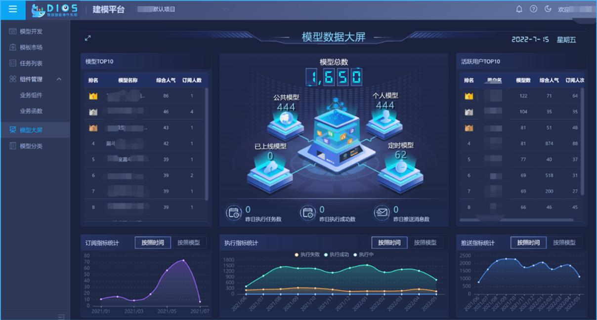

# 微前端

## 什么是微前端

微前端是一种多个团队通过独立发布功能的方式来共同构建现代化 web 应用的技术手段及方法策略。就是在一个 web 应用中可以独立的运行另一个 web 应用

### 核心价值

- 技术栈无关
  主框架不限制接入应用的技术栈，微应用具备完全自主权

- 独立开发、独立部署
  微应用仓库独立，前后端可独立开发，部署完成后主框架自动完成同步更新

- 增量升级
  在面对各种复杂场景时，我们通常很难对一个已经存在的系统做全量的技术栈升级或重构，而微前端是一种非常好的实施渐进式重构的手段和策略

- 独立运行时
  每个微应用之间状态隔离，运行时状态不共享

### 为什么不直接用 iframe？

如果不考虑体验问题，iframe 几乎是最完美的微前端解决方案。存在问题如下

- 浏览器原生隔离，完美解决 js、css 隔离问题，但是应用上下文难以共享，包括内存变量、数据同步、内外通信、cookie 透传
- 路由状态丢失，浏览器刷新一下，iframe 的 url 状态就丢失了
- 慢。每次打开白屏时间太长，对于 SPA 应用来说无法接受
- dom 结构不共享。弹框只能在 iframe 内部展示，无法覆盖全局

## 微前端编年史

### 1. 概念阶段

微前端的概念是由 ThoughtWorks 在 2016 年提出的，它借鉴了微服务的架构理念，核心在于将一个庞大的前端应用拆分成多个独立灵活的小型应用，每个应用都可以独立开发、独立运行、独立部署，再将这些小型应用融合为一个完整的应用，或者将原本运行已久、没有关联的几个应用融合为一个应用。微前端既可以将多个项目融合为一，又可以减少项目之间的耦合，提升项目扩展性，相比一整块的前端仓库，微前端架构下的前端仓库倾向于更小更灵活。

主力工具：iframe

### 2. 模块化加载

随着前端模块化工具的发展，微前端解决方案开始引入模块化加载器，如 Webpack 和 SystemJS

- Webpack：通过使用 Webpack 的动态导入（Dynamic Imports）和插件，可以实现模块的按需加载。
- SystemJS：是一种模块加载器，可以用于动态加载模块，尤其是在单页面应用（SPA）中

```js
// 通过 Webpack 4 的 import() 实现动态加载

import('path/to/module').then(module => {
  // 使用模块
  module.someFunction();
});
```

优点：

- 按需加载，提高了资源利用效率。
- 更少的性能开销，相较于 iframe。

缺点：

- 依然较为复杂的配置。
- 需要解决模块间依赖和共享的问题。

### 3. 微前端框架的出现

为了更好地解决微前端的复杂性和多样性需求，出现了一些专门的微前端框架和平台。

- Single-SPA：是一个 JavaScript 框架，可以帮助你在一个页面上组合多个微前端子应用，支持多种框架（如 React、Vue、Angular 等）。核心思想是将不同的微前端应用按照路由来分离，并在路由切换的时候激活相应的子应用。
- qiankun：qiankun 是基于 Single-SPA 的进行封装和扩展的一个微前端解决方案，它提高了开发体验和框架兼容性。配置化的应用接入更简单，提供了 css、js 沙箱及主子通讯方法，还提供了预加载的能力
- wujie：使用 shadowDom 隔离 css，使用空的 iframe 隔离 js，通讯使用的是 proxy
- micro-app：基于 webcomponent + qiankun sandbox 的微前端方案

:::code-group

```js [single-spa]
// single-spa
import { registerApplication, start } from 'single-spa';

registerApplication(
  'app1',
  () => import('path/to/app1'),
  location => location.pathname.startsWith('/app1')
);

registerApplication(
  'app2',
  () => import('path/to/app2'),
  location => location.pathname.startsWith('/app2')
);

start();

// 子应用
const appOptions = {
  el: '#vue', // 增加一个属性挂在到父应用的 id为vue的标签上
  router,
  render: h => h(App)
};

// 把vue和上面这个对象传入进去  这个singleSpaVue就会返回vueLife
// vueLife是包装好的生命周期  对应的就是bootstrap mount unmount  这三个方法
const vueLife = singleSpaVue({
  Vue,
  appOptions
});

//导出这三个方法
//协议接入  我定好了这些方法  父应用会调用这些方法
export const bootstrap = vueLife.bootstrap;
export const mount = vueLife.mount;
export const unmount = vueLife.unmount;
```

```js [qiankun]
// 主应用
import { registerMicroApps, start } from 'qiankun';

registerMicroApps([
  {
    name: 'app1',
    entry: '//localhost:7100',
    container: '#container',
    activeRule: '/app1'
  },
  {
    name: 'app2',
    entry: '//localhost:7200',
    container: '#container',
    activeRule: '/app2'
  }
]);

start();

// 子应用
export async function mount(props) {
  ReactDOM.render(
    <App />,
    props.container ? props.container.querySelector('#root') : document.getElementById('root')
  );
}
```

````js [模块联邦]
// 模块联邦
// 模块提供方
// webpack.config.js
module.exports = {
  // ...
  plugins: [
    new ModuleFederationPlugin({
      name: 'app1',
      filename: 'remoteEntry.js',
      exposes: {
        './Button': './src/Button'
      }
    })
  ]
};

// 模块消费方
// webpack.config.js
module.exports = {
  // ...
  plugins: [
    new ModuleFederationPlugin({
      name: 'app2',
      remotes: {
        app1: 'app1@http://localhost:3001/remoteEntry.js'
      }
    })
  ]
};
```
:::

以 qiankun 为代表的方案

> [!TIP]
>
> - 监听路由自动的加载、卸载当前路由对应的子应用
> - 完备的沙箱方案，js 沙箱做了 SnapshotSandbox、LegacySandbox、ProxySandbox 三套渐进增强方案，css 沙箱做了两套 strictStyleIsolation、experimentalStyleIsolation 两套适用不同场景的方案
> - 路由保持，浏览器刷新、前进、后退，都可以作用到子应用
> - 应用间通信简单，全局注入

> [!CAUTION]
>
> - 基于路由匹配，无法同时激活多个子应用，也不支持子应用保活
> - 改造成本较大，从 webpack、代码、路由等等都要做一系列的适配
> - css 沙箱无法绝对的隔离，js 沙箱在某些场景下执行性能下降严重
> - 无法支持 vite 等 ESM 脚本运行

以 wujie 为代表的方案

:::tip
1. 多应用同时激活在线。
- 框架具备同时激活多应用，并保持这些应用路由同步的能力
2. 组件式的使用方式。
- 无需注册，更无需路由适配，在组件内使用，跟随组件装载、卸载
3. 应用级别的 keep-alive。
- 子应用开启保活模式后，应用发生切换时整个子应用的状态可以保存下来不丢失，结合预执行模式可以获得类似 ssr 的打开体验
4. 纯净无污染。
- 无界利用 iframe 和 webcomponent 来搭建天然的 js 隔离沙箱和 css 隔离沙箱
- 利用 iframe 的 history 和主应用的 history 在同一个 top-level browsing context 来搭建天然的路由同步机制
- 副作用局限在沙箱内部，子应用切换无需任何清理工作，没有额外的切换成本
5. 性能和体积兼具。
- 子应用执行性能和原生一致，子应用实例 instance 运行在 iframe 的 window 上下文中，避免 with(proxyWindow){code}这样指定代码执行上下文导致的性能下降，但是多了实例化 iframe 的一次性的开销，可以通过 preload 提前实例化
- 体积比较轻量，借助 iframe 和 webcomponent 来实现沙箱，有效的减小了代码量
6. 开箱即用。
- 不管是样式的兼容、路由的处理、弹窗的处理、热更新的加载，子应用完成接入即可开箱即用无需额外处理，应用接入成本也极低
:::

### 4. 模块联邦


## 个推中台业务微前端落地

### 业务背景介绍

中台业务部门提供通用的大数据能力，在给业务部门赋能的同时，自身也沉淀了一套大数据操作系统


基座。作为微前端的入口，负责登录校验、权限配置、部门管理、用户管理等所有公共的模块，并向子应用下发诸如皮肤变量、用户信息、公用状态等数据


建模平台。子应用接入运行



机器学习平台。子应用嵌套


应用市场。子应用页面自由组合


### 微前端为团队带来了什么价值

1. 灵活的业务场景构想

- 自由组合子应用页面。细分到子应用菜单级别，用户可自定义创建拖拽创建页面组合即“自定义应用”，实现场景化、定制化的业务流
- 自由嵌套子应用组件。每个应用自身作为子应用接入的同时，还可提供自身的组件，极大减少业务开发量
- 定制化部署。对于不同客户的定制化部署需求，无需多次打包，一份配置项即可完成子应用的接入与否
- 对现有业务的整合。高效、快速的将现有业务集成，聚合成如工作流

3. 独立开发、部署带来的便利

- 独立仓库、独立团队，能够针对性地响应客户需求，各自独立打包提测，维护更方便，速度更快
- 兼容不同技术栈。对于远古项目使用的老旧技术栈能够快速接入，已接入项目技术栈重构也可以按项目逐个迭代，甚至可以进一步按模块拆分，颗粒度更细
- 降低单个项目复杂度，减少维护成本

2. 既独立又统一

- 主应用统一引入皮肤包。子应用统一使用css变量，仅修改主应用即可完成所有应用的皮肤新增、切换
- 主应用统一做数据埋点。子应用无需做任何改动

### 微前端带来了什么问题

1. 多应用运行与单应用运行行为不一致的问题。single-spa重写了某些原生方法，比如history.push，使其必然触发popstate事件，会导致路由守卫等路由相关行为不符合正常的预期
2. 微前端提供了沙箱，但各应用间并非完完全全的隔离。如localStorage、sessionStorage、history等都是共用的，需要针对各个共用部分，拉齐团队规范，避免出现如A团队往localStorage中存了变量被B团队覆盖的问题
3. 各团队独立打包，存在多余的代码引入，且版本可能不一。A、B团队都使用了vue技术栈，各自本地打包
4. 共有问题的修改成本高。子应用统一使用了某组件库，但该组件库仅为单体应用设计，并未考虑多应用实例，导致多应用场景下出现问题，如果子应用是自行打包，需要在组件库修改完后，子应用逐个更新依赖并部署。同时，由于项目的负责团队不同，往往涉及到非常长的沟通流程


## 我们真的需要微前端吗

如果你不知道自己是否需要用微前端，那么大概率是不需要

- [2023 微前端技术方案选型](https:\/\/juejin.cn/post/7236021829000691771#heading-10)
- [微前端方案解析](https:\/\/lianpf.github.io/posts/frontend-develop/microfrontend_framework_compare#1%e5%ae%9e%e7%8e%b0%e6%96%b9%e6%a1%88-2)

## qiankun 是怎么做 js 隔离的

sandbox，参数默认为 true，对于 js 隔离，默认使用 proxy 沙箱，有个文档上没写的隐藏参数 loose，区分使用 legacySandbox 和 proxySandbox

```ts
type QiankunSpecialOpts = {
  /**
   * @deprecated internal api, don't used it as normal, might be removed after next version
   */
  $$cacheLifecycleByAppName?: boolean;
  prefetch?: PrefetchStrategy;
  sandbox?:
    | boolean
    | {
        strictStyleIsolation?: boolean;
        experimentalStyleIsolation?: boolean;
        /**
         * @deprecated We use strict mode by default
         */
        loose?: boolean;
        /**
         * use speed sandbox mode, enabled by default from 2.9.0
         */
        speedy?: boolean;
        patchers?: Patcher[];
      };
  /*
    with singular mode, any app will wait to load until other apps are unmouting
    it is useful for the scenario that only one sub app shown at one time
  */
  singular?: boolean | ((app: LoadableApp<any>) => Promise<boolean>);
  /**
   * skip some scripts or links intercept, like JSONP
   */
  excludeAssetFilter?: (url: string) => boolean;

  globalContext?: typeof window;
};
````

```ts
const useLooseSandbox = typeof sandbox === 'object' && !!sandbox.loose;
// enable speedy mode by default
const speedySandbox = typeof sandbox === 'object' ? sandbox.speedy !== false : true;
let sandboxContainer;
if (sandbox) {
  sandboxContainer = createSandboxContainer(
    appInstanceId,
    // FIXME should use a strict sandbox logic while remount, see https://github.com/umijs/qiankun/issues/518
    initialAppWrapperGetter,
    scopedCSS,
    useLooseSandbox,
    excludeAssetFilter,
    global,
    speedySandbox
  );
  // 用沙箱的代理对象作为接下来使用的全局对象
  global = sandboxContainer.instance.proxy as typeof window;
  mountSandbox = sandboxContainer.mount;
  unmountSandbox = sandboxContainer.unmount;
}
```

qinakun 在创建沙箱时有以下代码

```ts
function createSandboxContainer(
  appName: string,
  elementGetter: () => HTMLElement | ShadowRoot,
  scopedCSS: boolean,
  useLooseSandbox?: boolean,
  excludeAssetFilter?: (url: string) => boolean,
  globalContext?: typeof window,
  speedySandBox?: boolean
) {
  let sandbox: SandBox;
  if (window.Proxy) {
    // 如果浏览器支持Proxy，使用LegacySandBox或者ProxySandbox
    sandbox = useLooseSandbox
      ? new LegacySandbox(appName, globalContext)
      : new ProxySandbox(appName, globalContext, { speedy: !!speedySandBox });
  } else {
    // 否则使用SnapshotSandBox
    sandbox = new SnapshotSandbox(appName);
  }

  // ...
}
```

### 快照沙箱

基于 diff 实现，只适用单例，且会污染 window

原理：将 window 的快照信息存到 windowSnapshot 中，将应用对于 window 属性的丢该记录到 modifyPropsMap 中，加载应用时用来还原，卸载应用时还原 window

### 代理沙箱

#### legacySandbox

单例，跟快照沙箱差不多，也会污染 window，但是性能比快照好

#### ProxySandbox

创建了 fakeWindow，set 操作都在 fakeWindow 上，取值优先从 fakeWindow 上取，不会污染 window，且支持多例

需要注意对于 window 的拷贝是浅拷贝，一些对象属性如 history，主子应用是共用的

## qiankun 是怎么做 css 隔离的

sandbox 参数，有两个是关于 css 的，strictStyleIsolation 默认 false、experimentalStyleIsolation 默认 false

strictStyleIsolation 为 true 时，用 shadowDom 隔离，shadowDom 的特点是：

- 影子节点内的导入样式不会影响外层
- mode 为 closed 时，外层无法获取影子节点内的元素
- 影子节点内的元素样式会继承其宿主元素的样式
- 影子节点内的元素无法被外层选择器选中

experimentalStyleIsolation 为 true 时，类似 vue 的 scoped 实现，通过属性选择器隔离
