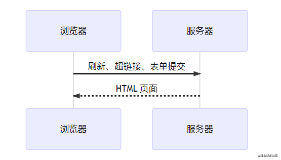
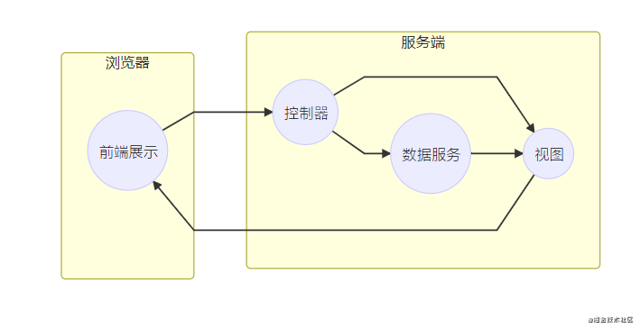
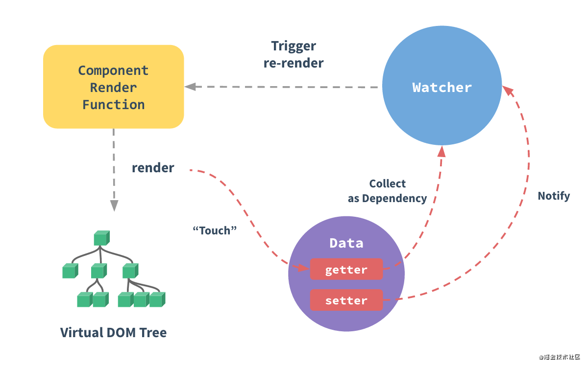

# vue

## 为什么要使用单页面应用

### 传统的网页应用

---



传统的网页应用，浏览器作为展示层，路由处理、服务调用、页面跳转都由后端处理，即便有 ajax，但也并不是标准的单页面应用。
这种网页应用的重心都在后端，后端几乎包揽了 MVC，浏览器端仅是一个展示层

### 单页面应用

---

MVC 前置到浏览器端，前端负责路由，各个小的组件组成页面，在路由变化时，不刷新整个页面，仅仅是组合小的组件，替换变化部分。甚至数据层也在前端，前端封装后端 API，这种情况下，后端只是提供操作数据库的 API

### 单页面应用的优点

---

- 不刷新页面，相应快速，提升了用户体验
- 前端组件化，代码的结构和组织更加规划化，利于修改和维护，并且可以开发独立的组件库，开发时直接使用即可，极大提高了开发效率
- API 共享，如果要多端开发（浏览器、微信、安卓、ios），只需要修改容易变化的前端 UI，对后端 API 的调用基本是相同的，极大的降低了开发成本

### 单页面应用的缺点

---

- 首次加载大量资源
- 提高了前端的技术门槛
- 不利于 SEO，因为数据在前端渲染，动态的数据不利于爬虫抓取
- 不方便使用浏览器自带的导航

---

## vue 核心

### vue 的响应式原理

vue2 通过数据劫持 ➕ 发布订阅模式实现数据响应式
主要由`Object.defineProperty`、`Observer`、`Dep`、`Watcher`实现


#### Observer、Dep 和 Watcher

---

Vue 封装了一个`defineReactive`方法来对数据进行`defineProperty`改造

```javascript
function defineReactive(obj: Object, key: string, val: any) {
  Object.defineProperty(obj, key, {
    get: function reactiveGetter() {
      //添加依赖
      dep.depend();
      return value;
    },

    set: function reactiveSetter(newVal) {
      //发布
      dep.notify();
    }
  });
}
复制代码;
```

`defineReactive`方法在改造数据的时候，数据 get 时进行依赖的添加，set 时发布

```javascript
class Observer {
  value: any;
  dep: Dep;

  constructor (value: any) {
    this.value = value
    this.dep = new Dep()
    if(Array.isArray(value)){
      //遍历出来挨个用Observer去new一下
    }else{
       //是对象就遍历，挨个进行响应式改造改造
       const keys = Object.keys(obj)
       for (let i = 0; i < keys.length; i++) {
           defineReactive(obj, keys[i])
       }
    }
 }
复制代码
```

`Observer`的作用其实就是**数据劫持**，而 Vue 让每一个**响应式**的数据都是被`Observer`改造过的

```javascript
class Dep {
  static target: ?Watcher;
  id: number;
  subs: Array<Watcher>;
  constructor() {
    this.id = uid++;
    this.subs = [];
  }
  addSub(sub: Watcher) {
    this.subs.push(sub);
  }
  removeSub(sub: Watcher) {
    remove(this.subs, sub);
  }
  depend() {
    if (Dep.target) {
      Dep.target.addDep(this);
    }
  }
  notify() {
    const subs = this.subs.slice();

    for (let i = 0, l = subs.length; i < l; i++) {
      subs[i].update();
    }
  }
}
复制代码;
```

`dep`里维护一个`watcher`列表`subs`，并且有`depend`和`notify`方法，能添加`watcher`并且发布通知，在 get 数据时，添加`watcher`到`subs`，`set`数据时，遍历`subs`并挨个执行更新
`Watcher`  类，`addDep`添加依赖（订阅），并具有`update`方法

```javascript
class Watcher {
  addDep (dep: Dep) {
    const id = dep.id
    //添加依赖（订阅操作）
    dep.addSub(this)
  }
  update () {
      this.run()
  }
  run () {
    if (this.active) {
       //执行数据更新
    }
  }
复制代码
```

## 关于对象

vue 无法检测属性的添加或移除，对于已经创建的实例，Vue 不允许动态添加根级别的响应式 property。但是可以用`Vue.set(object,propertyName,value)`
如果要为已有对象赋值多个新的 property，应该用原对象与要混合进去的对象的 property 一起创建一个新的对象。

```javascript
// 代替 `Object.assign(this.someObject, { a: 1, b: 2 })`
this.someObject = Object.assign({}, this.someObject, { a: 1, b: 2 });
```

## 关于数组

数据也不是响应式的，直接修改数组内某项和修改数组的长度都是无法被检测的。也需要用 Vue.set

```javascript
// Vue.set
Vue.set(vm.items, indexOfItem, newValue);
```

vue 改写了数组的常用方法，用这些方法操作数组能使数组被检测到

- `push()`
- `pop()`
- `shift()`
- `unshift()`
- `splice()`
- `sort()`
- `reverse()`

## 生命周期

生命周期钩子自动绑定 this 上下文，所以不能用尖头函数，因为箭头函数绑定了父上下文，而不是当前实例

| 生命周期钩子                                                                              | 调用时机                                                                                                                                  |
| ----------------------------------------------------------------------------------------- | ----------------------------------------------------------------------------------------------------------------------------------------- |
| beforeCreate                                                                              | 实例初始化后，还没有进行数据观测 (data observer) 和 event/watcher 事件配置                                                                |
| created                                                                                   | 实例创建完成之后立即调用，已经完成数据观测 (data observer)，property 和方法的运算，watch/event 事件回调，但还没有挂载 dom，所以$el 不可用 |
| beforeMount                                                                               | 挂载开始之前，render 首次被调用                                                                                                           |
| mounted                                                                                   | 挂载完毕时调用，此时根实例已经挂载到了某个文档元素上。但是不保证所有子组建也都被挂载，用 vm.$nextTick 可等到整个视图渲染完毕              |
| beforeUpdate                                                                              | 数据更新时调用，但是是在虚拟 dom 打补丁之前                                                                                               |
| updated                                                                                   | 虚拟 dom 重新渲染和打补丁完毕后调用。                                                                                                     |
| updated 不会保证所有的子组件一起被重绘，如果要等到整个视图重绘完毕，需要使用 vm.$nextTick |
| activated                                                                                 | kepp-alive 缓存的组建激活时调用                                                                                                           |
| deactivated                                                                               | keep-alive 的组件停用时调用                                                                                                               |
| beforeDestroy                                                                             | 实例销毁前调用，这一步里实例仍然完全可用                                                                                                  |
| destroyed                                                                                 | 实例销毁后调用                                                                                                                            |

## 组件间通信

1. 父传子用 prop
1. 子向父用$on和$emit，子组件通知父组件改值
1. 兄弟组件传值，通过父组件传递或者用 eventBus

举例：

```javascript
//Bus.js
import Vue from 'vue'

export default new Vue()

//Child1.vue
<template>
    <button @click="clickHandle"> {{n}}</button>
</template>
<script>
import Event from '../bus'

export default {
  name: 'Child1',
  data(){
    return{
      n:100
    }
  },
  methods: {
    clickHandle () {
      Event.$emit('update:count',n)
    }
  }
}
</script>
<style>
 ...
</style>

//Child2.vue
<template>
    <p>这是新的n:{{n}}</p>
</template>
<script>
import Event from '../bus'

export default {
  name: 'Child2',
  data(){
    return{
      n:0
    }
  }
  created(){
      Event.$on('update:count',(n)=>{
        console.log(n)
        this.n=n
      })
  }
}
</script>
<style>
 ...
</style>
```

4. 任意组件传值，用 vuex

## 其他不常用的方法

1. 所有子组件都可以通过`$root`获取根实例。

可以直接`this.$root.xxx`读写根组件的数据、计算属性和方法。
可以将根实例作为一个全局 store 来使用
只适用于小型 demo，大型项目直接用 vuex

2. 子组件可以通过`$parent`访问父组件

用法同上，但是不推荐使用，因为这样会导致程序复杂时无法得知父组件的变更是从哪里发起的

3. 依赖注入 provide/inject

祖先组件提供一个数据/方法

```javascript
provide: function () {
  return {
    getMap: this.getMap
  }
}
```

任意的后代获取这个数据/方法

```javascript
inject: ['getMap'];
```

4. ref 访问子组件实例或子元素

你可以通过 `ref` 这个 attribute 为子组件赋予一个 ID 引用。例如：

```vue
<base-input ref="usernameInput"></base-input>
```

现在在你已经定义了这个 `ref` 的组件里，你可以使用：

```vue
this.$refs.usernameInput
```

`$refs`只会在组件渲染完成后生效，并且不是响应式的。避免在模版或计算属性中访问$refs

## vuex 核心

vuex 是一个单一状态树，作为一个唯一数据源使用

### State

全局注册

```javascript
const app = new Vue({
  el: '#app',
  // 把 store 对象提供给 “store” 选项，这可以把 store 的实例注入所有的子组件
  store,
  components: { Counter },
  template: `
    <div class="app">
      <counter></counter>
    </div>
  `
});
```

通过 this.$store 访问，vuex 也是响应式的，我们可以用计算属性获取 vuex 中的数据

### Getters

vuex 的计算属性
接受 state 作为第一个参数

```javascript
const store = new Vuex.Store({
  state: {
    todos: [
      { id: 1, text: '...', done: true },
      { id: 2, text: '...', done: false }
    ]
  },
  getters: {
    doneTodos: state => {
      return state.todos.filter(todo => todo.done);
    }
  }
});
```

同样通过 `this.$store.getters.xxx`  访问
getter 也可以返回一个函数，可以实现给 getter 传参，但是这样会每次都进行调用，而不会缓存结果

### Mutations

注册一个事件，接收 state 作为第一个参数

```javascript
const store = new Vuex.Store({
  state: {
    count: 1
  },
  mutations: {
    increment(state) {
      // 变更状态
      state.count++;
    }
  }
});
```

子组件中触发这个事件

```javascript
store.commit('increment');
```

可以传参数，vuex 里叫做 **载荷 payload** 
可以传单个参数，推荐用对象的形式提交载荷

```javascript
// ...
mutations: {
  increment (state, payload) {
    state.count += payload.amount
  }
}
```

```javascript
store.commit('increment', {
  amount: 10
});
```

此外，还有对象风格的提交方式，其他用法照常

```javascript
store.commit({
  type: 'increment',
  amount: 10
});
```

mutation 需要遵守 Vue 的响应规则

### Actions

mutation 必须是同步函数，异步回调中进行的状态的改变都是不可追踪的
Action 类似于 mutation，但是

- Action 提交的是 mutation，而不是直接变更状态
- Action 可以包含任意异步操作

```javascript
const store = new Vuex.Store({
  state: {
    count: 0
  },
  mutations: {
    increment(state) {
      state.count++;
    }
  },
  actions: {
    increment(context) {
      context.commit('increment');
    }
  }
});
```

### Modules

为了避免 store 太过臃肿，我们可以分割模块

```javascript
const moduleA = {
  state: () => ({ ... }),
  mutations: { ... },
  actions: { ... },
  getters: { ... }
}
const moduleB = {
  state: () => ({ ... }),
  mutations: { ... },
  actions: { ... }
}
const store = new Vuex.Store({
  modules: {
    a: moduleA,
    b: moduleB
  }
})
```

