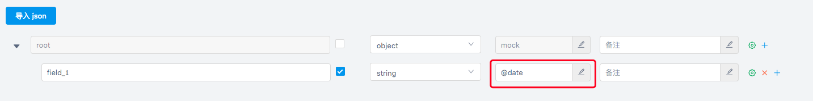
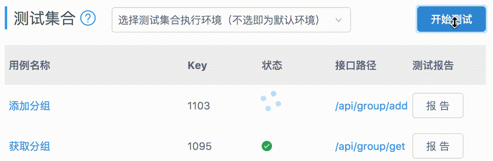
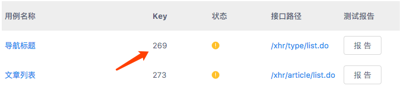
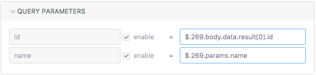
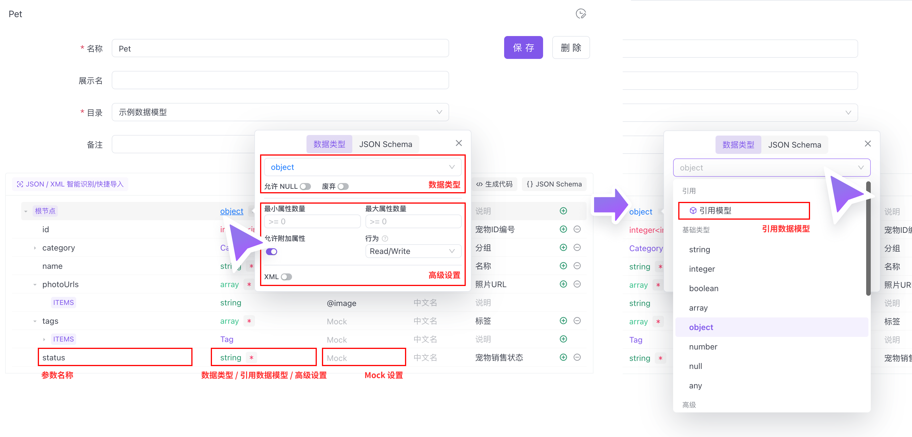
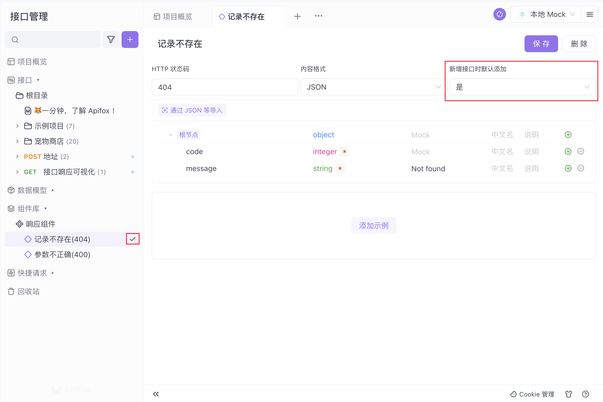
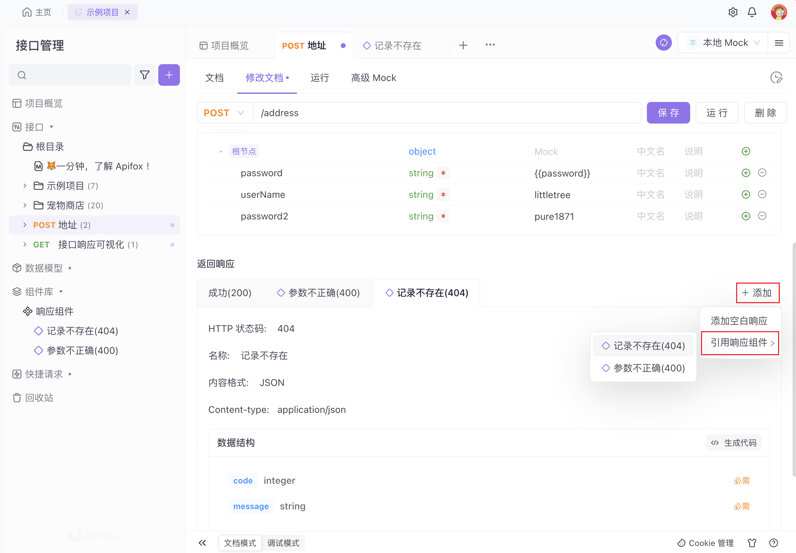

<script setup>
  import ApiTest from './components/ApiTest.vue'
</script>

# 接口测试平台

## 背景

前后端开发阶段，未部署接口时，前端需要模拟接口来开发，尽可能地模拟真实接口请求和数据能更好的完成开发工作

::: danger 常规开发的痛点：

1. 前端 mock 数据大段大段的复制粘贴写在项目代码里，如果没有及时清理，会增加不必要的项目体积
2. 前端将数据写在项目里，如果想要添加逻辑，需要写更多的临时代码
3. 后端给出的接口文档不具备修改通知和 diff 功能，需要仔细询问核对哪些经过修改，且后续无历史记录
   :::

::: tip 基于上述，核心需求有如下几点：

1. 交互友好的接口文档
2. 接口更改时，可追溯、可通知
3. 模拟接口可调用
4. 零侵入的、便于使用的数据 mock 系统
   :::

## yapi 简介

yapi 是一个开源的接口管理平台，目前 star 数量 27.3k，具备以下特性：

1. 权限管理
2. 项目管理
3. 可视化接口管理，接口修改记录可追溯
4. 基于 mock.js，方便的 mock 数据生成器
5. 接口自动化测试
6. 数据导入，支持 swagger、postman、har 数据格式，便于迁移

## 快速上手

新建项目->新建分类->添加接口

配置接口代理，使用`nginx`或者`代理工具`配置代理

#### 举例 nginx 代理配置

```nginx
server {
  listen 443 ssl;
  server_name test.jarrett.com;

  ssl_certificate SSL/test.jarrett.com.crt;
  ssl_certificate_key SSL/test.jarrett.com.key;

  location / {
    proxy_pass https://xx.xx.x.xxx:443/;
    proxy_set_header Host https://xx.xx.x.xxx:443/;
    proxy_set_header X-Real-IP $remote_addr;
    proxy_set_header X-Forwarded-For $proxy_add_x_forwarded_for;
    proxy_set_header X-Forwarded-Photo $scheme;
  }

  location /api/getUsers{
    proxy_pass http://xx.xx.x.xxx:3000/mock/83/api/getUsers;
    proxy_set_header Host http://xx.xx.x.xxx:3000;
    proxy_set_header X-Real-IP $remote_addr;
    proxy_set_header X-Forwarded-For $proxy_add_x_forwarded_for;
    proxy_set_header X-Forwarded-Photo $scheme;
  }
}
```

vite 热更新配置

```json
{
  "server": {
    "hmr": {
      "port": 8888 // 对应nginx监听的端口
    }
  }
}
```

接口测试

<ApiTest/>

## 创建模拟数据

### mockjs 使用语法

[数据模板定义示例](<[https://](http://mockjs.com/examples.html)>)

```json
// 正则
{
  "name|regexp": "[a-z0-9_]+?",
  "type|regexp": "json|text|xml"
}
// 根据请求参数定义返回值
{
  "name": "${query.name}", //请求的url是/path?name=xiaoming, 返回的name字段是xiaoming
  "type": "${body.type}",   //请求的requestBody type=1,返回的type字段是1
}
// 快速定义value
{
  "errcode": 0,
  "errmsg": "@word",
  "data": {
    "id": "@id", //@id 随机生成 id
    "name": "@name" //@name 随机生成用户名
  }
}
```

### json-schema



## 高级 mock

### Mock 期望

- 自定义过滤规则，返回自定义数据，支持 mock
- 可定义接口延时
- 可定义 http 状态码

### 自定义 Mock 脚本

#### 全局变量

请求

- `header` 请求的 HTTP 头
- `params` 请求参数，包括 Body、Query 中所有参数
- `cookie` 请求带的 Cookies

响应

- `mockJson` 接口定义的响应数据 Mock 模板
- `resHeader` 响应的 HTTP 头
- `httpCode` 响应的 HTTP 状态码
- `delay` Mock 响应延时，单位为 ms
- `Random` Mock.Random 方法，可以添加自定义占位符,详细使用方法请查看

示例 1，根据请求参数重写 mockJson

```js
if (params.type == 1) {
  mockJson.errcode = 400;
  mockJson.errmsg = 'error';
}

if (header.token == 't') {
  mockJson.errcode = 300;
  mockJson.errmsg = 'error';
}

if (cookie.type == 'a') {
  mockJson.errcode = 500;
  mockJson.errmsg = 'error';
}
```

## 自动化测试

传统的接口自动化测试成本高，大量的项目没有使用自动化测试保证接口的质量，仅仅依靠手动测试，是非常不可靠和容易出错的。

YApi 为了解决这个问题，开发了可视化接口自动化测试功能，只需要配置每个接口的入参和对 RESPONSE 断言，即可实现对接口的自动化测试，大大提升了接口测试的效率。



用例之间可以互相引用数据





## 竞品

市面上还有一些商业化接口管理平台，如 Apifox，提供了更加丰富的功能，可付费私有化部署

[Apifox](https://app.apifox.com/main/teams/2803313?tab=project)

### 数据模型



### 组件





## 最佳实践

- 前端（或后端）在 Apifox 上定好接口文档初稿。
- 前后端 一起评审、完善接口文档，定好接口用例。
- 前端 使用系统根据接口文档自动生成的 Mock 数据进入开发，无需手写 mock 规则。
- 后端 使用接口用例 调试开发中接口，只要所有接口用例调试通过，接口就开发完成了。如开发过中接口有变化，调试的时候就自动更新了文档，零成本的保障了接口维护的及时性。
- 后端 每次调试完一个功能就保存为一个接口用例。
- 测试人员 直接使用接口用例测试接口。
- 所有接口开发完成后，测试人员（也可以是后端）使用集合测试功能进行多接口集成测试，完整测试整个接口调用流程。
- 前后端 都开发完，前端从 Mock 数据切换到正式数据，联调通常都会非常顺利，因为前后端双方都完全遵守了接口定义的规范。
