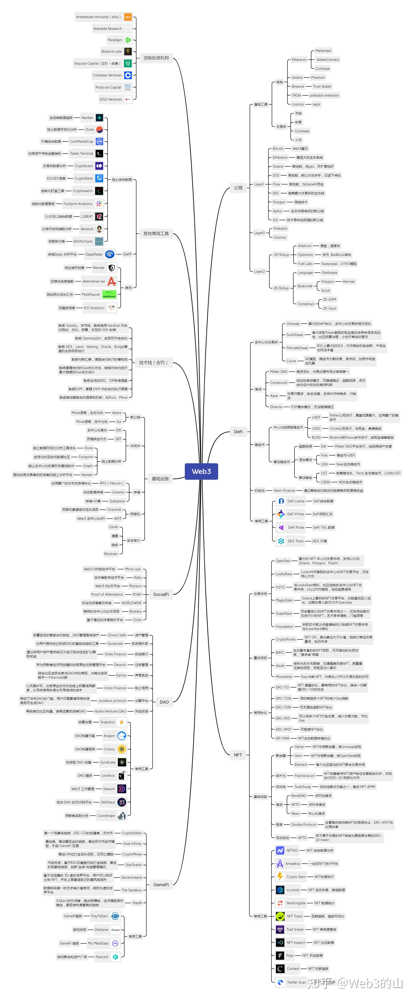

# WEB3

## 学习路线

公链-DeFi-NFT-GameFi-DAO、SocialFi-基础设施

公链是一切的基础；DeFi 是 Web3 的发动机；NFT 相对独立又特殊，是新的应用范式；GameFi 需要“游戏+NFT+DeFi”的融会贯通；DAO 和 SocialFi 更多的是聚焦在人的角度去设计的产品；隐私、存储等基础设施赛道涉及到的知识相对比较难懂，可以作为扩展类的学习。

## 概念

基于区块链的去中心化，涵盖了数字货币、智能合约、区块链技术、硬件基础设置（VR、AR、存储、传感器等）、非同质化代币（NFT）、Defi 去中心化金融服务、元宇宙 Metaverse 以及全新的社区治理模式 DAO 等

- 数字货币是 Web3 社会的灵魂。提供了社会的通行货币，用它们可以实现 Web3 自己的经济系统
- 区块链和智能合约，相当于 Web3 社会的土地和土壤，一切的建设、收获、活动都基于在这片土壤之上
- 去中心化自治组织 DAO，是 Web3 社会的组织形式，将人与人团结成为共同体的制度
- Web3 金融和 Defi，为 Web33 的世界提供了流动的金钱，为资产带来价值，给人们带来了激励和收入
- 元宇宙和 NFT 相当于人们在 Web3 领域里消费和活动的场景及数字化产品

传统 web2 在早期用户沉淀的过程中采用免费模式、羊毛出在羊身上、现金激励等手段。

web3 则是把行业打造成共建社区。发行非常便宜的代币或者股份给非常分散化的用户，由大家共建社区。web3 可以把
web2 的东西重做一遍。比如 2018 年的“Decentraland”，土地有限供应，可以自由买卖

### 公链

公链着眼于建设 Web3 的底层基础，围绕“去中心化、可扩展性、安全性”的“不可能三角”做技术的改进与探索。

### DeFi

DeFi 致力于提升 Web3 的资产利用效率，构建链上的去中心化金融体系，它是各类项目的发动机和连接器，极大的丰富了链上应用场景，给用户提供了新的利益来源，提升了 Token 流动性。

- 借贷与去中心化交易所是 DeFi 的核心。
- 流动性挖矿使 Defi 的动力进一步增强

### NFT

NFT 扩展了 Web3 的应用领域。从单一的金融属性开始向品牌、实物发展。Web3 需要考虑如何与其他领域互通，NFT 可能是其中一个正确答案

### GameFi

用户过少是阻碍 Web3 发展的重要原因，GameFi 很有可能打开这扇流量之门。Play2Earn 的模式吸引了大量用户参与

GameFi 的本质还是 DeFi，游戏只是它的外壳。

### DAO、SocialFi

DAO 是全新的团队组织架构，极具活力与效率

## 知识图谱

## WAGMI

We’re All Going to Make It

共建、共赢是 web3 的正确三观

## 市场的涨跌

任何交易市场都存在牛市、熊市，如何以正确的姿势面对熊市？

回归本心，默念以下几个问题：

1. 互联网巨头们垄断的世界是否真的走向了衰败
2. web3 是不是值得期待的对抗这些巨头们的筹码
3. 我们设想的新领域的构件是否仍然值得在下一阶段进行大量投资
4. 熊市里那些基本面强的项目是否变得更便宜了
5. 市场上是否有充足的资金可用于资助真正有含金量的项目
6. 是否相信 5-10 年内市场会重返牛市

需要的注意的是：

1. 非专业交易员，不要使用杠杆赌博
2. 不要为了不必要的投资负债
3. 不要做空

在牛市需要注意的是：

1. 市场异动引来监管风险
2. 比特币成为数字黄金。衡量比特币市场的基本面，用 MVRV 数值，即比特币的名义流通数值与其实际已实现市值（当下时间内链上所有比特币流通时最后价格的总和）相比，非长期持有者，当比例到 3，就是最好的抛售获益时间（约为 10-12.5 万美元之间），低于 1 就补仓
3. 以太坊超越（FaceBook、Apple、Microsoft、Google、Amazon）中的任何一家。代表 web3 底层成熟，也就是其币价天花板，在此之前，我们永远可以期待下一波牛市
4. DeFi 金融被收编。目前交易量还不到全球银行市值的 1%，但是回报率极高，有大量的诈骗属性的资金盘割了大量韭菜
5. 当大妈和阿姨都在讨论 NFT。虚拟货币在中国属于非法金融产品，NFT（Non-Fungible Token 非同质化代币）在中国也就被改名为 NFC 了（Non-Fungible Collection 非同质化数字藏品）。顾名思义，为一个数字作品（可以是图片、音乐、视频或者某组程序）赋予唯一的一串编码，使其具有“独一无二”的属性。但事实上，并不是所有的“独一无二”都经得起推敲的。NFT 本质上还是代币，流通性差，有价无市。国内的数字藏品不上链，更加不能用于赚钱

## 分布式存储和去中心化物联网是 Web3 的基座

分布式存储是 Web3 基础设施的一个关键层，将稳步抢占现有互联网基础设施供应商的利润

## 比特币正在建立数字黄金的地位

其地位稳固，稀缺性的马太效应能轻而易举煽动狂热

## 以太坊能否挑战比特币

微乎其微。eth 如果能超越比特币，更可能是市场认为这是世上最好的分布式虚拟计算机及其增长潜力比比特币更高

## 赛道研究

# 参考

- [Web3 新手教程：从入门到精通](https://zhuanlan.zhihu.com/p/647524814)
- [Web3 漫游指南](https://mirror.xyz/tannhauser2049.eth/vPrV-lqGjFpT2VWT4kDvtjhZayxm6n8ym7ra4wiegSc)
